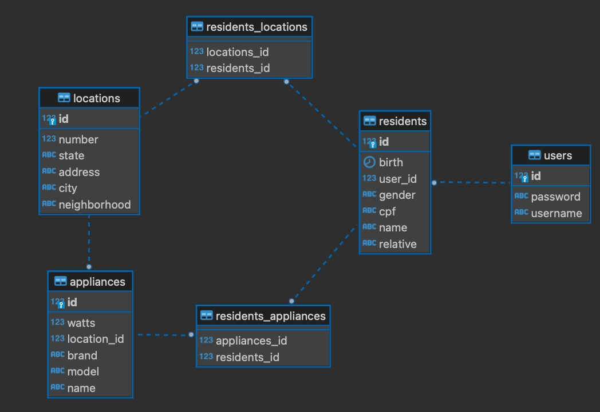

# Energy Monitor :battery: :bar_chart:
Tech Challenge - Phase 2 - Graduate/Pós-Graduação

GitHub Repository: https://github.com/igorgrv/energyMonitor-graduate
Swagger: http://localhost:8080/swagger-ui/index.html

H2:http://localhost:8080/database
username: admin
password: 

## About :book:

Welcome to Energy Monitor! An innovative project that combines the powerful technologies of:

* Java 17;
* Maven; 
* Spring Boot;
* Spring Validation;
* Lombok;
* H2

## Entity-relationship

## Challenges

* Finding best practices for a restfull api 
* Solution: https://www.alura.com.br/artigos/rest-principios-e-boas-praticas
* Entity-relationship modeling
